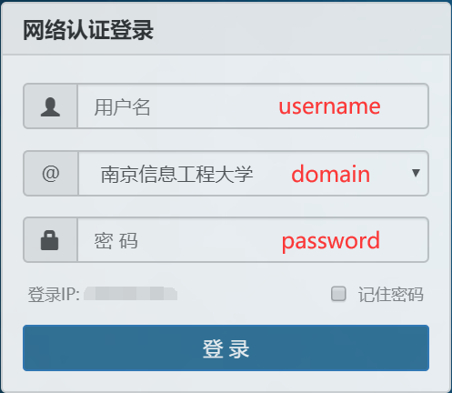

# Auto Login

南信大校园网自动登录 in python

## 动机

有时连接校园网后，不会跳出登录的网页，故写此脚本，实现一键登录，或连接 WIFI 自动登录

## 已有功能

- 双击 AutoLogin.py 运行
- 自动**登录校园网**
- 若不想点击运行，可以参考[这篇博客](https://yharea.com/421/#%E5%85%B7%E4%BD%93%E6%AD%A5%E9%AA%A4)设置任务计划程序，实现**连接 WIFI 自动运行**

## 需要

- python
- 连校园网
- **修改文件 info.json 中的用户名（username）、密码（password）和登录方式（domain）**

  | 你要填在 domain 的内容 |   你的登录方式   |
  | :--------------------: | :--------------: |
  |        "NUIST"         | 南京信息工程大学 |
  |         "CMCC"         |     中国移动     |
  |       "ChinaNet"       |     中国电信     |
  |        "Unicom"        |     中国联通     |

## 未来功能

- 打包，无需 python 环境
